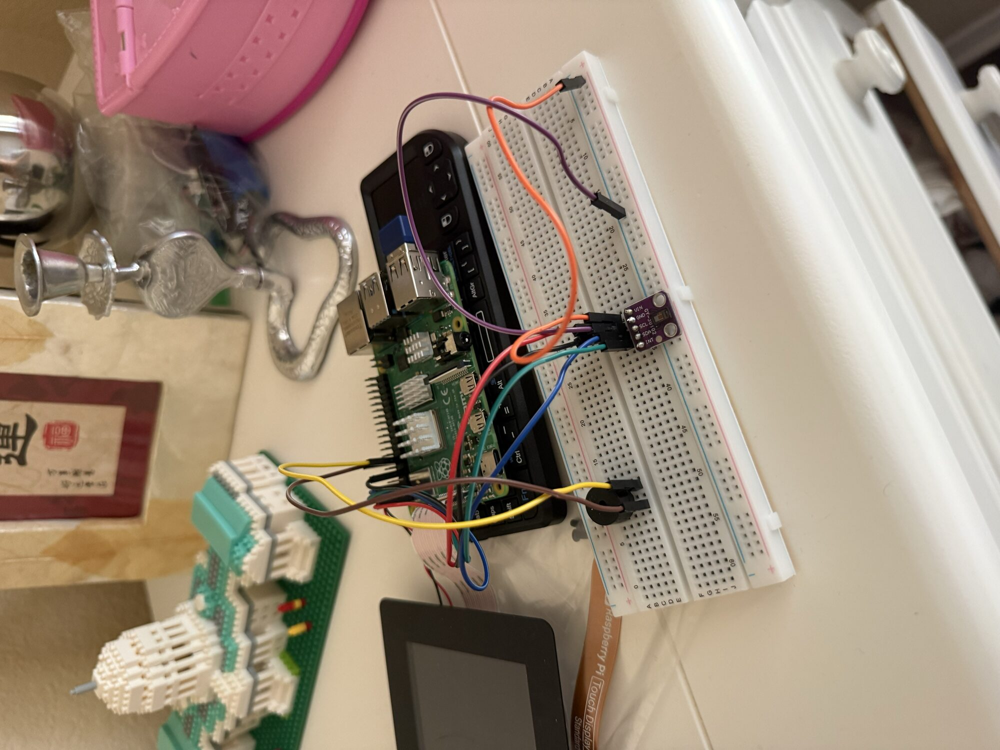
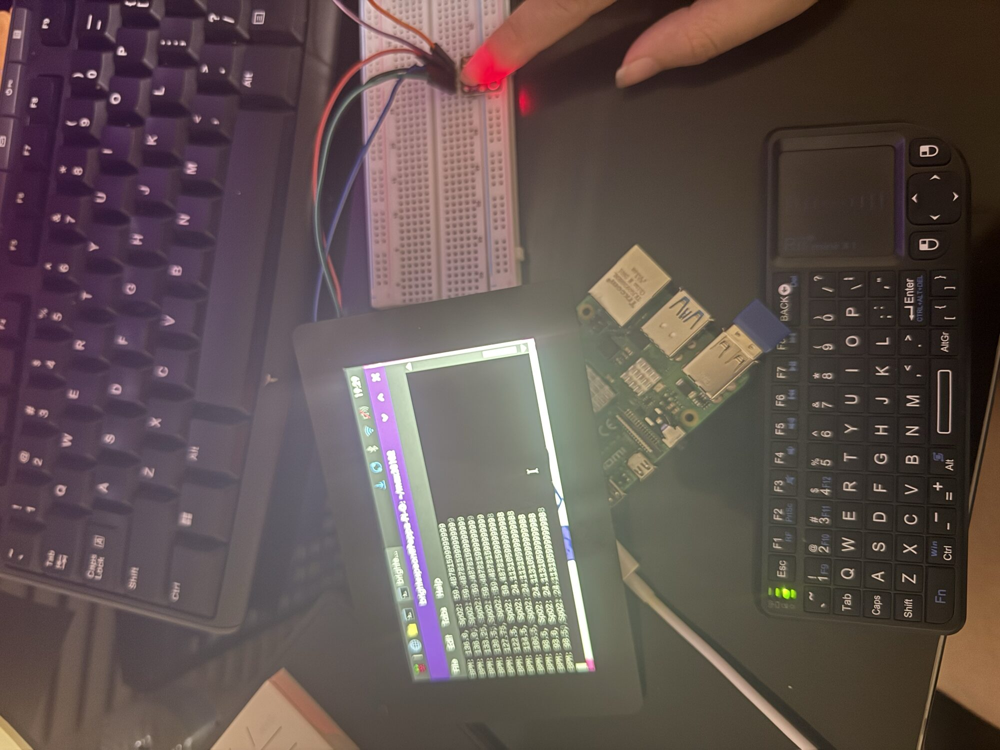
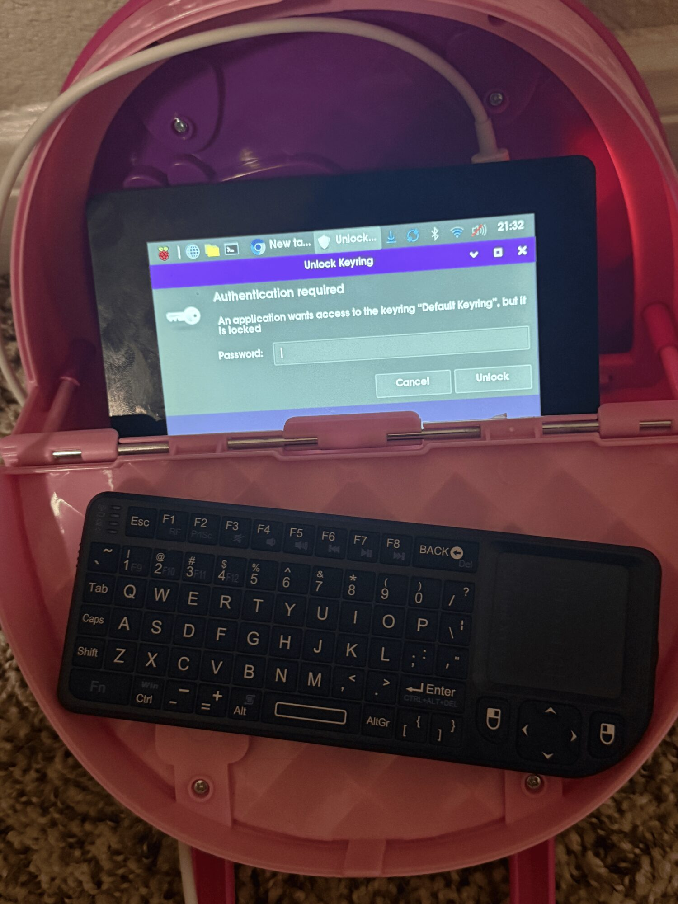
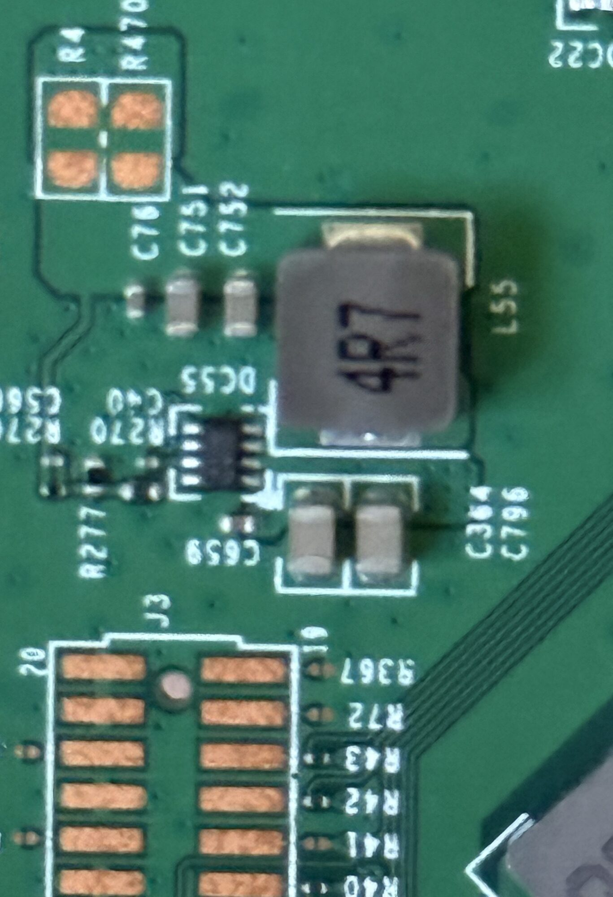
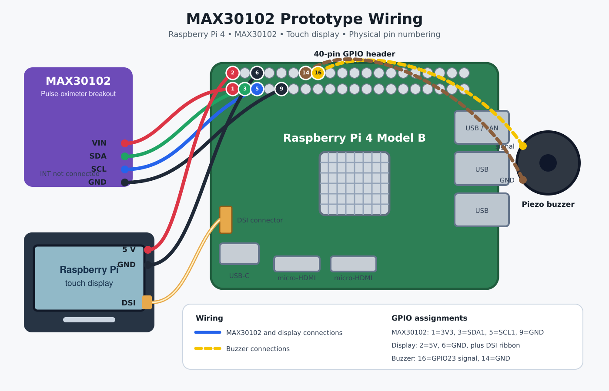

# MAX30102 Raspberry Pi Prototype

A personal project combining a MAX30102 sensor, Raspberry Pi 4, touchscreen, and buzzer. These photos show the build from breadboard testing through enclosure and power-supply changes.

## Background 2026 
This is a fork of the max30102 library by doug-burrell used for my personal HR monitor project. The project will be a module on my existing raspberry pi cyberdeck. This is a personal, non-clinical engineering project and is not intended for medical diagnosis or monitoring. 

## Breadboard setup

Initial sensor and buzzer connections for testing with the Raspberry Pi.



## Early signal testing

Early testing of the sensor output during prototype development.



## Enclosure prototype

Sensor, display, and supporting hardware brought together in the prototype enclosure.



## Power supply

Buck converter used in the updated battery-powered setup.



## Wiring diagram

Earlier wiring configuration. This diagram does not include the updated buck-converter power supply and needs revision.



## Development notes

See [progress-updates.txt](progress-updates.txt) for working notes.

Experimental prototype; not a clinically validated medical device.
# Upstream Readme

## Info
The code originally comes from: https://github.com/vrano714/max30102-tutorial-raspberrypi
but with some modifications so that it doesn't require the interrupt pin and
instead polls by checking the read and write FIFO pointers. I've also added a
top level of code that encapsulates everything into a thread.

The original code is a Python port based on Maxim's reference design written to
run on an Arduino UNO: https://github.com/MaximIntegratedRefDesTeam/RD117_ARDUINO/

## Setup
A couple non-standard Python libraries are required: `smbus` and `numpy`. I recommend
installing the `numpy` library with apt as opposed to pip since pip takes a really
long time.
`sudo apt install python-numpy`

## Use as a script

Run `python main.py`, data will be printed in standard output. 

The full usage:

```
$ python main.py -h
usage: main.py [-h] [-r] [-t TIME]

Read and print data from MAX30102

optional arguments:
  -h, --help            show this help message and exit
  -r, --raw             print raw data instead of calculation result
  -t TIME, --time TIME  duration in seconds to read from sensor, default 30
```

## Use as a library
To use the code, instantiate the `HeartRateMonitor` class found in `heartrate_monitor.py`.
The thread is used by running `start_sensor` and `stop_sensor`. While the thread
is running you can read `bpm` to get the active beats per minute. Note that a few
seconds are required to get a reliable BPM value and the sensor is very sensitive
to movement so a steady finger is required!

